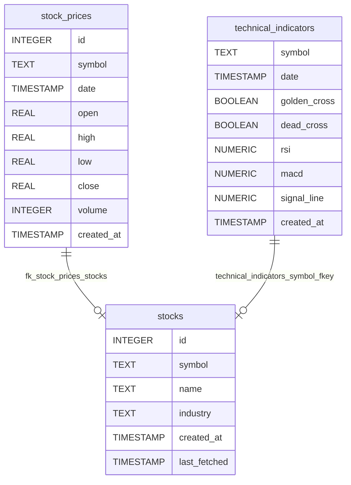

# 株価分析システム ER図

```mermaid
erDiagram
    technical_indicators {
        TEXT symbol
        TIMESTAMP date
        BOOLEAN golden_cross
        BOOLEAN dead_cross
        NUMERIC rsi
        NUMERIC macd
        NUMERIC signal_line
        TIMESTAMP created_at
    }
    stocks {
        INTEGER id
        TEXT symbol
        TEXT name
        TEXT industry
        TIMESTAMP created_at
        TIMESTAMP last_fetched
    }
    stock_prices {
        INTEGER id
        TEXT symbol
        TIMESTAMP date
        REAL open
        REAL high
        REAL low
        REAL close
        INTEGER volume
        TIMESTAMP created_at
    }
    stock_prices ||--o| stocks : "fk_stock_prices_stocks"
    technical_indicators ||--o| stocks : "technical_indicators_symbol_fkey"
```