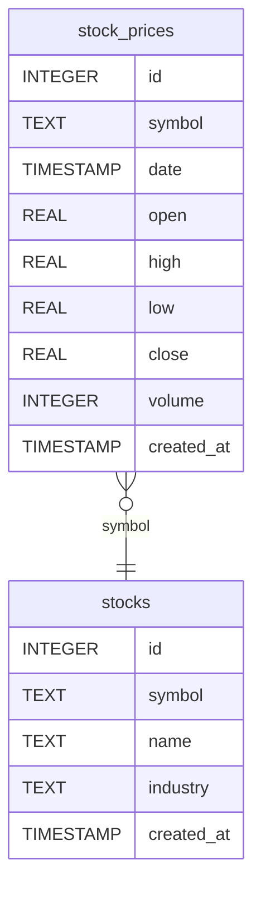

# 株価分析システム ER図

```mermaid
erDiagram
    stocks {
        INTEGER id
        TEXT symbol
        TEXT name
        TEXT industry
        TIMESTAMP created_at
    }
    stock_prices {
        INTEGER id
        TEXT symbol
        TIMESTAMP date
        REAL open
        REAL high
        REAL low
        REAL close
        INTEGER volume
        TIMESTAMP created_at
    }
    stock_prices }o--|| stocks : "symbol"
```
