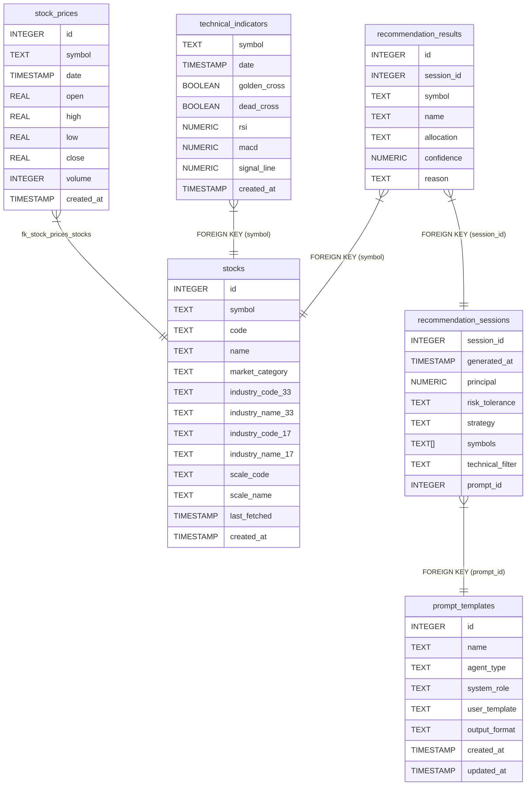

# 株価分析システム ER図

```mermaid
erDiagram
    stocks {
        INTEGER id
        TEXT symbol
        TEXT code
        TEXT name
        TEXT market_category
        TEXT industry_code_33
        TEXT industry_name_33
        TEXT industry_code_17
        TEXT industry_name_17
        TEXT scale_code
        TEXT scale_name
        TIMESTAMP last_fetched
        TIMESTAMP created_at
    }
    
    stock_prices {
        INTEGER id
        TEXT symbol
        TIMESTAMP date
        REAL open
        REAL high
        REAL low
        REAL close
        INTEGER volume
        TIMESTAMP created_at
    }
    
    technical_indicators {
        TEXT symbol
        TIMESTAMP date
        BOOLEAN golden_cross
        BOOLEAN dead_cross
        NUMERIC rsi
        NUMERIC macd
        NUMERIC signal_line
        TIMESTAMP created_at
    }
    
    recommendation_sessions {
        INTEGER session_id
        TIMESTAMP generated_at
        NUMERIC principal
        TEXT risk_tolerance
        TEXT strategy
        TEXT[] symbols
        TEXT technical_filter
        INTEGER prompt_id
    }
    
    recommendation_results {
        INTEGER id
        INTEGER session_id
        TEXT symbol
        TEXT name
        TEXT allocation
        NUMERIC confidence
        TEXT reason
    }
    
    prompt_templates {
        INTEGER id
        TEXT name
        TEXT agent_type
        TEXT system_role
        TEXT user_template
        TEXT output_format
        TIMESTAMP created_at
        TIMESTAMP updated_at
    }
    
    stock_prices }|--|| stocks : "fk_stock_prices_stocks"
    technical_indicators }|--|| stocks : "FOREIGN KEY (symbol)"
    recommendation_results }|--|| stocks : "FOREIGN KEY (symbol)"
    recommendation_results }|--|| recommendation_sessions : "FOREIGN KEY (session_id)"
    recommendation_sessions }|--|| prompt_templates : "FOREIGN KEY (prompt_id)"
```
