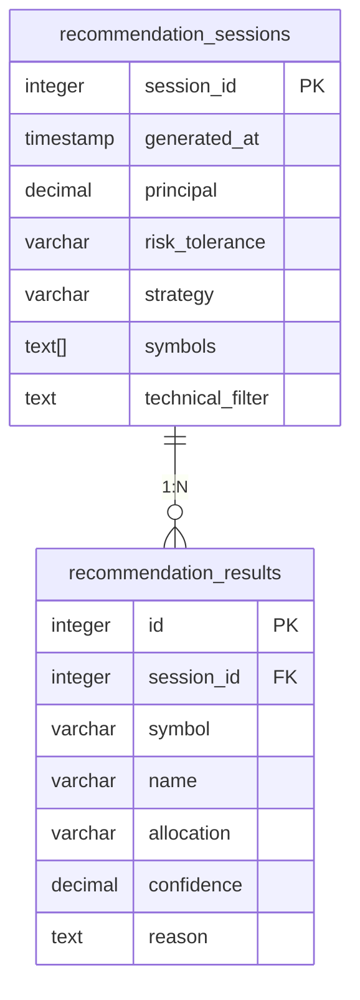

# システムパターン

## アーキテクチャ概要
- スクリプトベースのデータ処理パイプライン
- モジュール型アーキテクチャ（各機能が独立したスクリプト）
- バッチ処理による定期実行

## 主要コンポーネント
1. データ取得モジュール（stock_data_importer.py）
   - Yahoo Finance APIからのデータ取得
   - データの正規化とクリーニング
2. 分析エンジン（technical_indicator_calculator.py）
   - テクニカル指標の計算（移動平均線、RSI、ゴールデンクロス/デッドクロスなど）
   - 銘柄間の相関分析
3. レポートジェネレータ
   - Matplotlibを使用した可視化
   - PNG/PDF形式でのレポート出力
4. フロントエンドWebアプリ（React）
   - 銘柄一覧表示と検索機能
   - テクニカル指標の可視化
   - レポート閲覧インターフェース
5. データ管理層
- PostgreSQLデータベースへの保存
   - データのバックアップと復旧

## 設計パターン
- パイプラインパターン
  - データ取得 → 処理 → 出力の明確な分離
- ファサードパターン
  - 複雑な分析処理の簡易インターフェース提供
- ストラテジーパターン
  - 分析アルゴリズムの交換可能な実装
- コンポーネントベースアーキテクチャ（フロントエンド）
  - UIを独立した再利用可能なコンポーネントとして構築

## データフロー
1. データ取得モジュールがAPIから株価データを取得
2. 取得データをPostgreSQLデータベースに保存
3. 分析エンジンがデータを処理し指標を計算
4. レポートジェネレータが結果を可視化
5. レポートをファイルシステムに保存
6. フロントエンドがバックエンドAPI経由でレポートを取得・表示

## AIエージェントパターン
1. 基本構成要素
   - 拡張LLM: DeepSeek APIを利用
   - ツールインターフェース: 明確なドキュメントと使いやすい設計
   - データソース: Yahoo Finance API, PostgreSQLデータベース

2. ワークフローパターン (実装済み)
   - Evaluator-Optimizerパターン:
     - Evaluator: 銘柄の基本分析とフィルタリング
     - Optimizer: 投資戦略に基づく最適化
   - プロンプトチェイニング: タスクを連続したステップに分解
   - ルーティング: 入力分類と専門処理への振り分け
   - 評価-最適化: LLMが生成した出力を別のLLMが評価・改善

3. 自律エージェント (実装済み)
   - 環境フィードバックに基づくツール使用ループ
   - テクニカル指標フィルタリング
   - 投資パラメータに基づく推奨生成

4. 実装原則
   - シンプルな設計を維持 (Factoryパターン採用)
   - ロギングとエラーハンドリングの徹底
   - モジュール型アーキテクチャによる拡張性確保

5. 現在の実装状況
   - DeepSeek Directモード: 直接API呼び出し (実装済み)
   - MCP Agentモード: 拡張機能用 (開発中)
   - テクニカル指標フィルタリング (実装済み)
   - 推奨結果の根拠説明 (実装済み)

## 拡張ポイント
- 新しい分析指標の追加
- 追加データソースの統合
- 出力フォーマットの拡張（CSV、Excelなど）
- AIエージェント機能の統合

## データベーススキーマ

### 推奨システム関連テーブル

**関係説明**:
- `recommendation_sessions`と`recommendation_results`は1対多の関係
- セッションごとに複数の推奨結果を保持
- `session_id`が外部キーとして関連付け
