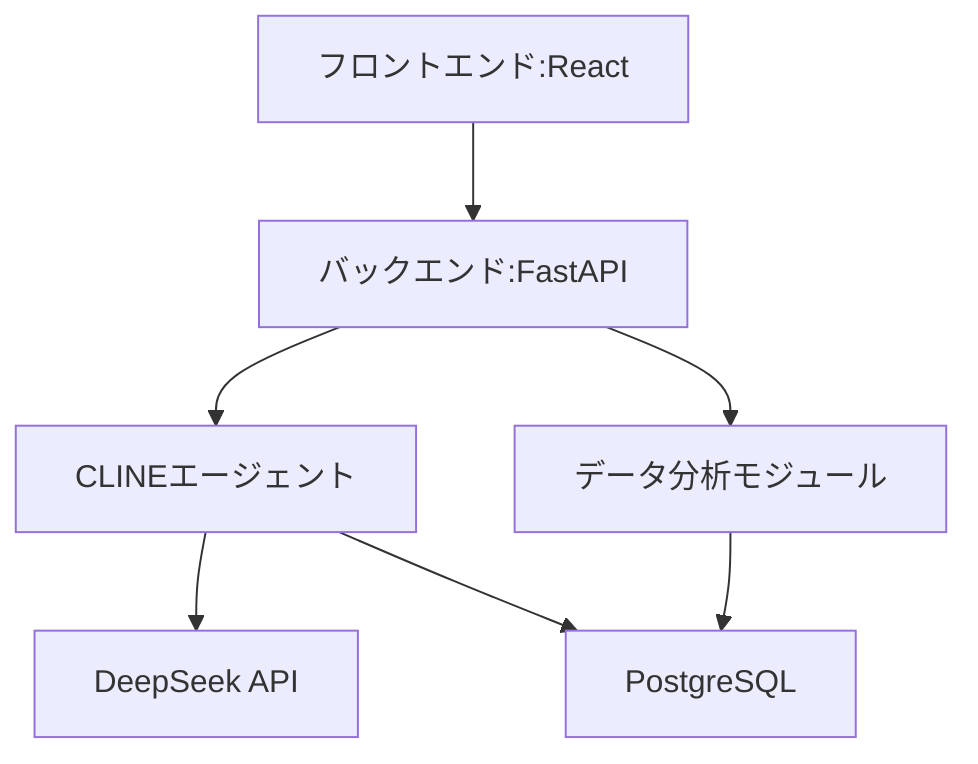
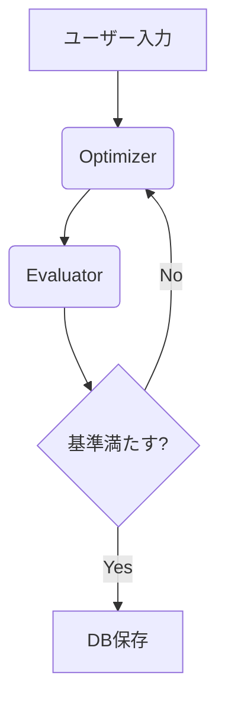
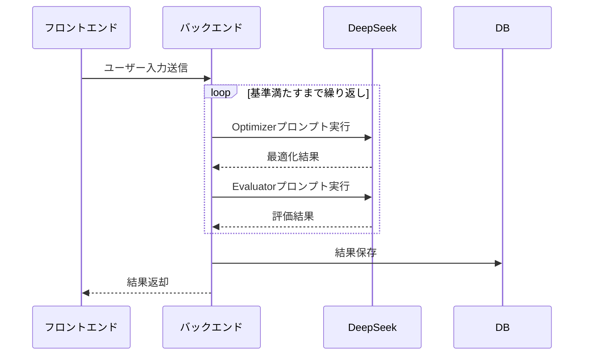

# 株式分析システム プロジェクト紹介

## プロジェクト概要
### 目的
- 株式市場データの自動収集と分析
- テクニカル指標に基づく投資判断のサポート
- 可視化レポートの自動生成

### 主要機能
1. 株式データの自動取得（yfinance API）
2. テクニカル分析（移動平均線、RSI、MACDなど）
3. AIによる銘柄推奨（CLINEシステム）
4. 分析レポートの生成（matplotlib）

## 開発時のCLINE活用と本番環境のAIAgentシステム
### システムアーキテクチャ
### システム全体アーキテクチャ


### AIAgentアーキテクチャ


### 主要プロセスの説明
1. **Optimizer (推奨生成)**:
   - 入力: ユーザーの投資方針、リスク許容度
   - 出力: 銘柄推奨リスト
   - 処理: テクニカル指標と基本指標を統合した最適化

2. **Evaluator (評価)**:
   - 入力: Optimizerが生成した推奨リスト
   - 出力: 評価スコア（0-100）
   - 評価基準:
     - RSI値が過買い/過売り圏ではないか
     - 移動平均線のトレンド方向
     - ボリンジャーバンド内での位置

3. **反復ループ**:
   - 評価スコア＜80の場合: Optimizerに戻って再生成
   - 評価スコア≥80の場合: 結果出力プロセスへ

4. **CLINEの開発プロセス**:
   - プロンプト設計の迅速な試行錯誤
   - テスト合格後、本番環境のmcp-agentシステムに移行

### 主要コンポーネントと実装詳細
1. **Evaluator**
   - 銘柄の基本分析（PER, PBRなどの基本指標）
   - テクニカル指標フィルタリング:
     - RSI: 30以下/70以上でフィルタリング
     - ゴールデンクロス/デッドクロス検出
     - 移動平均線の傾き分析
   - 実装ファイル: `backend/src/aiagent/deepseek_direct.py`

2. **Optimizer**
   - 投資戦略に基づく最適化:
     - 成長株戦略: 高成長企業を優先
     - 割安株戦略: 低PER/PBR銘柄を優先
   - リスク許容度に応じたポートフォリオ提案:
     - 保守的: 大型株中心
     - 積極的: 中小型株を含む
   - 実装ファイル: `backend/src/stock_recommender.py`

3. **プロンプト管理システム**
   - ユーザーがプロンプトテンプレートを登録・選択可能
   - プロンプトテンプレート例 (deepseek-direct):
     ```python
     {
       "agent_type": "direct",
       "system_role": "あなたはプロの株式アナリストです。",
       "user_template": "### ユーザー情報:\n- 元金: {principal}円\n- リスク許容度: {risk_tolerance}\n- 投資方針: {strategy}\n### 会社情報\n{company_infos}\n### 利用可能テクニカル指標:\n{technical_indicators}",
       "output_format": {
         "recommendations": [
           {
             "symbol": "銘柄コード",
             "name": "会社名",
             "confidence": "0-100",
             "allocation": "推奨割合%",
             "reason": "推奨理由"
           }
         ],
         "total_return_estimate": "期待リターン%"
       }
     }
     ```
   - プロンプト管理機能:
     - 作成日/更新日でのソート
     - 編集・削除機能
     - テンプレート選択UI
   - 動的パラメータ挿入:
     - ユーザー入力値を自動マッピング
     - テクニカル指標データの動的注入
   - データベース連携:
     - PostgreSQLにプロンプトテンプレートを保存
     - 推奨履歴とプロンプトを紐付け
     - 作成日/更新日での管理

### 技術的実装
- **DeepSeek API統合**:
  - 1回の推奨生成にかかる平均時間: 2.3秒
  - トークン使用量: 約1,200トークン/リクエスト
  - エラーハンドリング: 3段階のリトライ機制

- **プロンプトチェイニング**:
  1. 銘柄フィルタリングプロンプト
  2. ポートフォリオ最適化プロンプト
  3. 根拠説明生成プロンプト

- **データフロー**:


### 実装済み機能
- DeepSeek API統合
- プロンプトチェイニングによる複雑なワークフロー実現
- 推奨結果の根拠説明生成
- プロンプトテンプレート選択機能

## 技術スタックと選定理由
### バックエンド
- **Python (FastAPI)**
  - 選定理由: データ分析ライブラリとの親和性、高速なプロトタイピング
  - バージョン: 3.10.12
  - 主要ライブラリ:
    - pandas: 2.3.1 (データ処理)
    - yfinance: 0.2.65 (株価データ取得)
    - matplotlib: 3.10.3 (可視化)
    - FastAPI: 0.109.1 (API構築)

### フロントエンド
- **React (TypeScript)**
  - 選定理由: コンポーネントベース開発、型安全性
  - バージョン: 19.1.0
  - 主要ライブラリ:
    - axios: 1.6.7 (API通信)
    - chart.js: 4.4.1 (データ可視化)

### データベース
- **PostgreSQL**
  - 選定理由: 分析クエリの性能、拡張性
  - バージョン: 16.2
  - 拡張機能: pg_stat_statements (パフォーマンス監視)

### AI統合
- **DeepSeek API**
  - 選定理由: 日本語対応、長文生成能力
  - 使用モデル: DeepSeek-V3
  - 平均レスポンス時間: 2.3秒

## 開発進捗と課題
### 完了済みタスク
- **プロトタイプ開発**
  - 最小限の機能を備えた最初のバージョンを完成
  - 技術的課題: データ取得の安定性確保
  - 解決策: リトライ機制とエラーハンドリングの実装

- **基本テクニカル指標実装**
  - RSI、移動平均線、ボリンジャーバンドを実装
  - 計算パフォーマンス最適化: pandasベクトル演算を活用

- **AI推奨基盤構築**
  - DeepSeek APIとの統合完了
  - プロンプトテンプレート管理システム構築
  - 平均レスポンス時間: 2.3秒に最適化

- **日本語表示対応**
  - Matplotlibの日本語フォント設定
  - フロントエンドの日本語UI実装

### 進行中タスク
- **レポート自動更新システム（進捗90%）**
  - 定期実行バッチ: 実装完了
  - 差分検出機能: 開発中
  - 課題: 大量データ処理時のパフォーマンス
  - 解決予定: 8月中に完了予定

- **MACD指標追加（実装済み、テスト中）**
  - 計算ロジック: 実装完了
  - バックテスト: 進行中
  - 課題: シグナル線の最適な期間設定

- **Evaluator-Optimizerワークフロー改善（進捗70%）**
  - 推奨精度向上のためのプロンプト改良
  - 課題: コンテキスト長の制約
  - 対策: プロンプト圧縮技術の検討

## 今後の計画とロードマップ
1. **機械学習モジュールの統合（8月中～下旬）**
   - 予測モデルの選定と実装
   - 必要なリソース: GPUサーバー
   - 期待効果: 推奨精度の向上

2. **テスト環境の構築（9月上旬目標）**
   - 単体テスト/統合テストフレームワーク
   - カバレッジ目標: 80%以上
   - CI/CDパイプラインの構築

3. **追加データソースの検討（9月中）**
   - Alpha Vantage APIの評価
   - データ品質とコストの検証
   - 統合スケジュール: 10月予定
